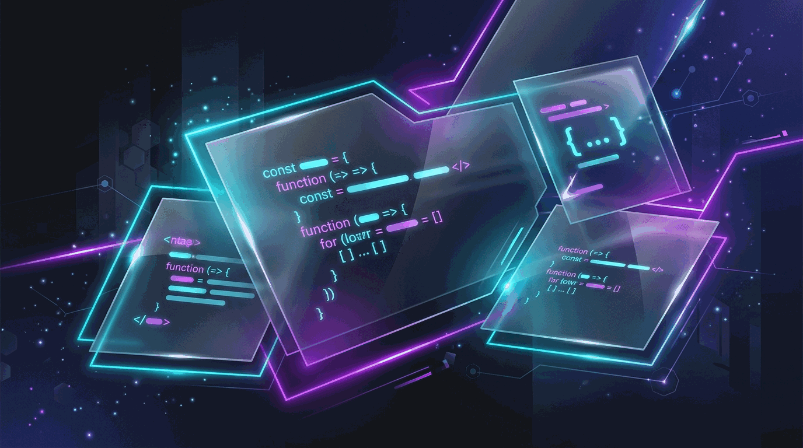

<div align="center">

  <!-- Floating Eyebrow Badge -->
  <p align="center">
    
  </p>

  # ⚡ TANISH SHAH — DEVELOPER PORTFOLIO
  
  **An ultra-responsive, high-performance developer workspace engineered with semantic HTML5, modern CSS3, and vanilla JavaScript.**

  <br />

  <!-- Premium Shields / Badges Row -->
  <p align="center">
    <a href="https://tanish1808.github.io/My_Portfolio/">
      
    </a>
    <a href="https://github.com/Tanish1808/My_Portfolio">
      
    </a>
    <a href="https://www.linkedin.com/in/tanish-shah-703489349/">
      
    </a>
    <a href="mailto:tanishshah1808@gmail.com">
      
    </a>
  </p>

  <!-- Metric Badges Row -->
  <p align="center">
    
    
    
    
  </p>

  <br />

  <!-- Hero Visual Showcase -->
  <p align="center">
    <a href="https://tanish1808.github.io/My_Portfolio/">
      
    </a>
  </p>

  <!-- Quick Navigation Pills -->
  <p align="center">
    <a href="https://tanish1808.github.io/My_Portfolio/"><strong>🌐 Launch Live Portfolio</strong></a>
    &nbsp;•&nbsp;
    <a href="#-architectural-overview">Architecture</a>
    &nbsp;•&nbsp;
    <a href="#-interactive-systems-showcase">Interactive Systems</a>
    &nbsp;•&nbsp;
    <a href="#-featured-software-projects">Featured Projects</a>
    &nbsp;•&nbsp;
    <a href="#-engineering-deep-dive">Engineering Highlights</a>
    &nbsp;•&nbsp;
    <a href="#-local-development">Run Locally</a>
  </p>

</div>

---

## 🎯 Executive Summary

Welcome to the central repository for **Tanish Shah's Personal Developer Portfolio**. This single-page application is engineered from first principles as an interactive, production-grade technical showcase.

Rather than assembling standard pre-built UI components or heavy SPA framework bundles, this project demonstrates mastery over the **modern native browser platform**:
- **Zero Framework Overhead:** Pure HTML5, modular CSS3, and ES6+ JavaScript.
- **Interactive Technical UX:** Embedded developer terminal CLI, 2D particle physics engine, and a real-time GitHub Git Graph.
- **High-Density Bento Grids:** Interactive code IDE previews, multi-stage education timelines, and 3D certification carousels.
- **Production Rigor:** Audited across 15+ responsive viewport dimensions (`320px` to `2560px`) with zero layout overflow and native motion accessibility.

---

## 🏛️ Architectural Overview

The portfolio operates on an asynchronous event-driven lifecycle managing state, telemetry, and canvas rendering loops without external runtime overhead.

```
┌─────────────────────────────────────────────────────────────────────────────────┐
│                                CLIENT BROWSER                                   │
└────────────────────────────────────────┬────────────────────────────────────────┘
                                         │
                 ┌───────────────────────┴───────────────────────┐
                 │                                               │
         ┌───────▼────────────────────────┐              ┌───────▼────────────────────────┐
         │     HTML5 & CSS3 LAYER         │              │    MODULAR JS CONTROLLERS      │
         │  • Semantic DOM Landmarks      │              │  • Central Event Loop Engine   │
         │  • Bento Grid Mastery Wall     │              │  • Local/Session Storage Cache │
         │  • Dynamic CSS Variables       │              │  • Async Fetch Dispatcher      │
         └────────────────────────────────┘              └───────┬─────┬────────────┬─────┘
                                                                 │     │            │
                 ┌───────────────────────────────────────────────┘     │            └─────────────────────────┐
                 │                                                     │                                      │
         ┌───────▼────────────────────────┐            ┌───────────────▼────────────────┐             ┌───────▼────────────────────────┐
         │       TELEMETRY & APIS         │            │        CANVAS ENGINES          │             │       INTERACTIVE MODALS       │
         │  • GitHub REST API v3 Stream   │            │  • 2D Particle Physics (Hero)  │             │  • Dual-Action PDF Viewer      │
         │  • Web3Forms AJAX Transceiver  │            │  • Matrix Digital Rain (CLI)   │             │  • 3D Credential Spotlight     │
         │  • Clipboard API Feedback      │            │  • Prefers-Reduced-Motion Gate │             │  • Keyboard Focus & Escape Trap│
         └────────────────────────────────┘            └────────────────────────────────┘             └────────────────────────────────┘
```

---

## 🚀 Interactive Systems Showcase

<table>
  <tr>
    <td width="50%" valign="top">
      <h3>💻 1. Interactive Developer Terminal</h3>
      <ul>
        <li><strong>Full CLI Emulator:</strong> Command router supporting <code>help</code>, <code>about</code>, <code>skills</code>, <code>projects</code>, <code>resume</code>, <code>contact</code>, <code>matrix</code>, <code>theme</code>, and <code>clear</code>.</li>
        <li><strong>Shell Utilities:</strong> History traversal via <kbd>↑</kbd>/<kbd>↓</kbd> keys, <kbd>Tab</kbd> auto-completion, and ANSI-colored output.</li>
        <li><strong>Security First:</strong> Strict input sanitization guarding against DOM injection.</li>
        <li><strong>Matrix Canvas Mode:</strong> Embedded Easter egg rendering animated digital glyph rain with graceful exit listeners.</li>
      </ul>
    </td>
    <td width="50%" valign="top">
      <h3>🌌 2. 2D Particle Physics Engine</h3>
      <ul>
        <li><strong>Proximity Clustering:</strong> Real-time dynamic distance calculations connecting nearby particle nodes.</li>
        <li><strong>Radial Cursor Repulsion:</strong> Interactive physics responding smoothly to mouse trajectory.</li>
        <li><strong>Theme-Synchronized:</strong> Particle palettes adjust dynamically between Dark (Cyan/Purple) and Light (Teal/Violet) modes.</li>
        <li><strong>Motion-Aware:</strong> Bypasses 60fps animation loops when <code>prefers-reduced-motion</code> is active.</li>
      </ul>
    </td>
  </tr>
  <tr>
    <td width="50%" valign="top">
      <h3>🎛️ 3. Split-Pane IDE Projects Studio</h3>
      <ul>
        <li><strong>VS Code Interface:</strong> Interactive editor tabs with problem statements, architecture tags, and repository links.</li>
        <li><strong>Impact & Scale Telemetry:</strong> Quantified engineering metrics (e.g., SLA compliance, CNN duplicate detection, geospatial querying).</li>
        <li><strong>Live GitHub REST Git Graph:</strong> Live commit stream fetched from GitHub APIs with status bar telemetry and <code>sessionStorage</code> caching.</li>
      </ul>
    </td>
    <td width="50%" valign="top">
      <h3>🧱 4. Skills Bento Wall & Live Code IDE</h3>
      <ul>
        <li><strong>Bento Grid Layout:</strong> High-density categorized cards (<em>Languages</em>, <em>Frontend</em>, <em>Backend</em>, <em>Tools</em>).</li>
        <li><strong>Live Code Switcher:</strong> Tab-based syntax previewer showcasing production patterns in Java, Python, and SQL.</li>
        <li><strong>Dynamic Filter Pills:</strong> Instant category filtering with smooth DOM transitions.</li>
      </ul>
    </td>
  </tr>
  <tr>
    <td width="50%" valign="top">
      <h3>🎓 5. Education Dashboard & Credential Deck</h3>
      <ul>
        <li><strong>Split-Stage Milestone Inspector:</strong> Interactive timeline displaying academic milestones, coursework lists, and CGPA metrics.</li>
        <li><strong>3D Holographic Carousel:</strong> Touch-enabled credential deck with category badges and instant in-browser PDF modal inspection.</li>
      </ul>
    </td>
    <td width="50%" valign="top">
      <h3>🎨 6. Theme Engine & Cyber Contact Hub</h3>
      <ul>
        <li><strong>5-Accent Neon Engine:</strong> Real-time customizer (*Cyber Cyan*, *Neon Purple*, *Emerald*, *Solar Gold*, *Crimson*) persisted via <code>localStorage</code>.</li>
        <li><strong>Dual-Mode Contact Hub:</strong> Form submission via Web3Forms with automatic native <code>mailto:</code> client fallback.</li>
      </ul>
    </td>
  </tr>
</table>

---

## 🛠️ Complete Technical Stack

| Domain | Technology / Resource | Key Implementation Purpose |
| :--- | :--- | :--- |
| **Markup & Structure** | **HTML5 Semantic Core** | Accessible document landmarks (`<nav>`, `<main>`, `<section>`, `<dialog>`, `<footer>`) |
| **Styling & Design System** | **Vanilla CSS3** | Custom properties (CSS variables), Glassmorphism backdrop-filters, CSS Grid, 3D Transforms |
| **Logic & Event System** | **JavaScript (ES6+)** | Native DOM controllers, `IntersectionObserver`, `MutationObserver`, Async Fetch API |
| **Visual Computing** | **HTML5 2D Canvas API** | Particle physics network and Matrix rain digital animation engine |
| **External Telemetry** | **GitHub REST API v3** | Real-time repository commit trees, stars, and activity metrics |
| **Form Transmission** | **Web3Forms API** | Direct asynchronous form submission endpoint with local client fallback |
| **Typography & Glyphs** | **Poppins, Font Awesome 6, Boxicons, Devicon** | Curated typography and scalable vector icons |
| **Persistence** | **localStorage & sessionStorage** | Client-side theme preferences and GitHub API rate-limit caching |
| **Deployment** | **GitHub Pages** | Automated continuous deployment pipeline directly from `main` |

---

## 🔬 Engineering Deep Dive

### 1. Consolidated Scroll Engine
To achieve silky-smooth 60fps scrolling and eliminate redundant layout reflows, three distinct window scroll listeners (Navbar glass elevation, back-to-top button trigger, and section scrollspy) were consolidated into a single unified listener:

```javascript
// Optimized Single-Pass Scroll Event Controller
const handleScrollTelemetry = () => {
    const scrollY = window.scrollY;
    
    // 1. Navbar Glass Elevation State
    if (scrollY > 50) {
        navbar.classList.add("scrolled");
    } else {
        navbar.classList.remove("scrolled");
    }
    
    // 2. Back-To-Top Button Visibility
    if (backToTopBtn) {
        backToTopBtn.classList.toggle("visible", scrollY > 400);
    }
    
    // 3. Section Scrollspy Active State Tracker
    updateActiveNavigation(scrollY);
};

window.addEventListener("scroll", handleScrollTelemetry, { passive: true });
```

### 2. Resilient API Telemetry with Session Caching
The Live Git Graph controller queries the GitHub REST API while protecting against public rate-limiting:
- Fetches real-time commits and metadata for featured repositories.
- Stores responses in `sessionStorage` with automatic timestamp validation.
- Gracefully falls back to a verified static dataset if offline or rate-limited.

### 3. Asset Payload Optimization
- All high-resolution project screenshots were converted from legacy PNG formats to modern **`.webp`** format.
- Reduced asset footprint by **>70%** (e.g., `578 KB` PNG $\rightarrow$ `73 KB` WebP) while providing zero-downtime `.png` fallback compatibility.

### 4. Accessibility & Motion Inclusivity (WCAG AA/AAA)
- **`prefers-reduced-motion` Media Query:** Automatically switches scroll behavior to `auto`, disables continuous glow pulses, and instructs the canvas engine to render a static constellation rather than looping animation frames.
- **Enhanced Light Mode Contrast:** Tuned secondary text color token (`--text-muted: #475569`), achieving a **5.87:1** contrast ratio on background and **7.01:1** on cards (exceeding WCAG AAA standards for large text and AA for body text).
- **Responsive Touch Targets:** Verified minimum `≥40px` tap targets across modal controls on screens down to `320px`.

---

## 📂 Repository Structure

```
My_Portfolio/
├── index.html                    # Semantic SPA markup, accessible dialogs & SEO meta tags
├── style.css                     # Consolidated design tokens, bento grids, responsive queries
├── script.js                     # Modular controllers (Terminal CLI, Git Graph, Canvas, Modals)
├── .gitignore                    # Git tracking rules
├── README.md                     # Professional project documentation
└── assets/                       # Static media, documentation & certificate assets
    ├── og_preview.png            # 1200x630 Open Graph / Twitter Card social preview
    ├── resume.pdf                # Verified professional resume PDF
    ├── *.webp / *.png            # High-efficiency WebP project previews & PNG fallbacks
    └── certificates/             # Verified academic & hackathon credential PDFs
        ├── Coursera Introduction To Java Certificate.pdf
        ├── Inheritance and Data Structure in Java.pdf
        ├── Introduction to HTML, CSS, & JavaScript.pdf
        ├── Exploratory Data Analysis for Machine Learning.pdf
        ├── LJ_Hackovate.pdf
        ├── LDCE X TechSprint_Participation.pdf
        └── Lakshya 2.0 Hackathon Participation .pdf
```

---

## 📌 Featured Software Projects

<details open>
<summary><strong>1. 🔍 Civic Lens — ML-Powered Municipal Issue Management</strong></summary>
<br />
<blockquote>
<strong>Stack:</strong> FastAPI • Django REST Framework • PyTorch • MongoDB (2dsphere) • React
</blockquote>
<ul>
  <li><strong>Computer Vision Pipeline:</strong> PyTorch CNN inference pipeline automatically classifying municipal issue categories and severity.</li>
  <li><strong>Two-Stage Duplicate Detection:</strong> Eliminates duplicate citizen reports using MongoDB 2dsphere geospatial radius queries combined with perceptual image hashing and CNN feature embeddings.</li>
  <li><strong>Role-Based Portal:</strong> Administrative analytics dashboard for municipal resolution KPIs and SLA compliance tracking.</li>
  <li>👉 <a href="https://github.com/Tanish1808/civic-lens"><strong>View Repository</strong></a></li>
</ul>
</details>

<details open>
<summary><strong>2. 🎫 Ticket Tally — Enterprise ITSM Incident Platform</strong></summary>
<br />
<blockquote>
<strong>Stack:</strong> Python • Flask • Neon PostgreSQL • Vanilla JS • JWT Auth
</blockquote>
<ul>
  <li><strong>Intelligent Incident Dispatch:</strong> Priority Queue algorithms automatically routing incoming support tickets based on severity and agent availability.</li>
  <li><strong>SLA Compliance Engine:</strong> Real-time countdown tracking ensuring adherence to enterprise response-time agreements.</li>
  <li><strong>Role-Based Access Control:</strong> Tiered permission tiers separating IT engineers, team leads, and system administrators.</li>
  <li>👉 <a href="https://github.com/Tanish1808/Trial_Ticket_Tally"><strong>View Repository</strong></a></li>
</ul>
</details>

<details>
<summary><strong>3. 🎓 Course Management System</strong></summary>
<br />
<blockquote>
<strong>Stack:</strong> Java • OOP Concepts • DBMS Architecture • File Handling
</blockquote>
<ul>
  <li>Academic administration platform for student enrollment, faculty course allocation, and automated GPA calculations.</li>
  <li>👉 <a href="https://github.com/Tanish1808/Course_Management_System"><strong>View Repository</strong></a></li>
</ul>
</details>

<details>
<summary><strong>4. 🏨 Hostel Management System</strong></summary>
<br />
<blockquote>
<strong>Stack:</strong> Java • Object-Oriented Design • Data Structures
</blockquote>
<ul>
  <li>Centralized management portal for room allocations, student directories, and fee transaction tracking.</li>
  <li>👉 <a href="https://github.com/Tanish1808/Hostel_Management_System"><strong>View Repository</strong></a></li>
</ul>
</details>

<details>
<summary><strong>5. 🚌 Bus Seat Reservation System</strong></summary>
<br />
<blockquote>
<strong>Stack:</strong> Core Java • Array Matrices • Booking Logic
</blockquote>
<ul>
  <li>Real-time visual seat allocation matrix with instant validation and ticket generation.</li>
  <li>👉 <a href="https://github.com/Tanish1808/Bus_Management_System"><strong>View Repository</strong></a></li>
</ul>
</details>

---

## 💻 Local Development & Quickstart

Because this portfolio is built with standard native web technologies, **no compilation, bundlers, or package installations are required**.

### 1. Clone the Repository
```bash
git clone https://github.com/Tanish1808/My_Portfolio.git
cd My_Portfolio
```

### 2. Launch Local Static HTTP Server
Running via a local HTTP server ensures smooth PDF iframe modal loading and CORS asset handling:

```bash
# Option A: Using Python 3 (Recommended)
python -m http.server 8000

# Option B: Using Node.js (npx)
npx serve .
```

### 3. Access in Browser
Open **`http://localhost:8000`** in your browser.

---

## 📊 Quality & Responsive Verification Matrix

| Viewport Category | Target Dimensions | Responsive Status | Layout Behavior |
| :--- | :--- | :---: | :--- |
| **Mobile Compact** | `320×568` – `375×667` | ✅ **Verified** | Single-column stacking, hamburger drawer, ≥40px touch targets |
| **Mobile Standard** | `390×844` – `430×932` | ✅ **Verified** | Optimal bento card margins, crisp typography clamps |
| **Tablet Portrait** | `768×1024` – `834×1194` | ✅ **Verified** | Split IDE converts to tab view, 2-column footer layout |
| **Standard Laptop** | `1280×720` – `1366×768` | ✅ **Verified** | Full 2-pane IDE active, interactive terminal side-by-side |
| **Desktop & FHD** | `1440×900` – `1920×1080` | ✅ **Verified** | Centered 1400px maximum bounds, expansive canvas physics |
| **Ultrawide Displays**| `2560×1440` | ✅ **Verified** | Edge-to-edge ambient particle background |

---

## 📬 Contact & Connect

<div align="center">

| Platform | Channel | Link |
| :--- | :--- | :--- |
| 🌐 **Live Portfolio** | Production Deployment | [tanish1808.github.io/My_Portfolio](https://tanish1808.github.io/My_Portfolio/) |
| 💻 **GitHub** | Codebase & Repositories | [@Tanish1808](https://github.com/Tanish1808) |
| 💼 **LinkedIn** | Professional Network | [Tanish Shah](https://www.linkedin.com/in/tanish-shah-703489349/) |
| ✉️ **Email** | Direct Inquiries | [tanishshah1808@gmail.com](mailto:tanishshah1808@gmail.com) |
| 📍 **Location** | India | Available for Software Engineering Roles & Opportunities |

<br />

<sub>Designed &amp; Engineered by <strong>Tanish Shah</strong> • © 2025–2026. All rights reserved.</sub>

</div>
